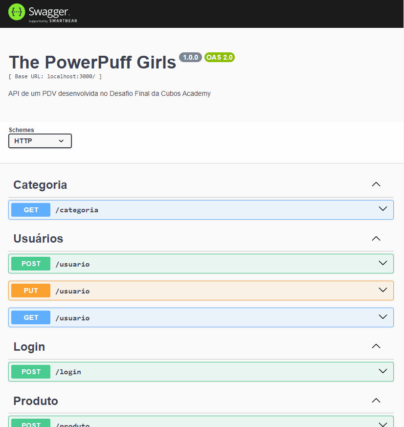

# API PDV Power Puff Girls 🖥️
<div align="center">

</div>

## Sobre o projeto

Este projeto é resultado do Desafio do Módulo 5 (Banco de dados e API's), do curso de Backend da [Cubos Academy](https://cubos.academy/cursos/desenvolvimento-de-software).
A aplicação conta com diversas funcionalidades, permitindo ao usuário se cadastrar, logar, visualizar e editar o seu perfil. O sistema também conta com autenticação JWT e criptografia através do Bcrypt, o que garante segurança na transferência de informações e no armazenamento de senhas.

## Funcionalidades

1. Cadastrar Usuário
2. Fazer Login
3. Detalhar Perfil do Usuário Logado
4. Editar Perfil do Usuário Logado
5. Listar Categorias
6. Cadastrar Produto
7. Editar Dados do Produto
8. Listar Produtos
9. Detalhar Produto
10. Excluir Produto
11. Cadastrar Cliente
12. Editar Dados do Cliente
13. Listar Clientes
14. Detalhar Cliente
15. Cadastrar Pedido
16. Listar Pedidos

## Como executar o projeto

⚠️ Para a execução do projeto, é necessário ter o [Node.js](https://nodejs.org/en) instalado em sua máquina.

1) Faça um clone do projeto

```bash
git clone https://github.com/Daaaiii/PDV-PowerPuffGirls.git
```

2) Abra o diretório do projeto

```bash
cd PDV-PowerPuffGirls
```

3) Instale as dependências utilizando o comando:

```bash
npm i
```

| Dependências  | Versão |
| :------------- | ------- |
| Express        | 4.18.2  |
| Nodemon        | 3.0.1   |
| PG             | 8.11.3  |
| Dotenv         | 16.3.1  |
| Json Web Token | 9.0.2   |
| Knex           | 3.0.1   |
| Joi            | 17.11.0 |
| Cors           | 2.8.5   |
| Bcrypt         | 5.1.1   |
| Aws sdk        | 2.1479.0|
| Multer         |1.4.5-lts.1|
| Swagger        | 5.0.0   |
| Swagger AutoGen| 2.23.6  |
| Handlebars     | 4.7.8  |
| Nodemailer     | 6.9.7  |

4) Inicialize o servidor local:

```bash
npm run dev
```

⚠️ Para verificar as rotas, pode-se importar o arquivo `Desafio Final.postman_collection.json` no Postman ou Insomnia, ou utilizar a extensão do Postman no VsCode.

## Verificando os endpoints

1) **Cadastrar usuário**

#### `POST` `/usuario`

 Esse endpoint permite o cadastro do usuário.

Validações:

    -   Validar o preenchimento dos campos obrigatórios;
    -   Validar se o e-mail informado já existe;
    -   Criptografar a senha antes de persistir no banco de dados;
    -   Cadastrar o usuário no banco de dados.

2) **Login do usuário**

#### `POST` `/login`

Esse endpoint realiza o login do usuário no sistema utilizando o email e senha cadastrados.

Validações:

    -   Validar o preenchimento dos campos obrigatórios;
    -   Verificar se o e-mail informado existe;
    -   Validar e-mail e senha;
    -   Criar token de autenticação com id do usuário.

3) **Detalhar usuário**

#### `GET` `/usuario`

Esse endpoint deverá apresentar os dados do usuário logado no sistema.

Validações:

    -   Validar se o token foi enviado no header da requisição (Bearer Token);
    -   Verificar se o token enviado é válido;
    -   O usuário deverá ser identificado através do ID presente no token de validação;
    -   Consultar o usuário no banco de dados pelo id contido no token informado;

4) **Editar perfil do usuário**

#### `PUT` `/usuario`

Esse endpoint deve atualizar os dados do usuário logado no sistema.

Validações:

    -   Validar se o token foi enviado no header da requisição (Bearer Token);
    -   Verificar se o token enviado é válido;
    -   O usuário deverá ser identificado através do ID presente no token de validação;
    -   Validar o preenchimento dos campos obrigatórios;
    -   Validar se o novo e-mail já existe no banco de dados para outro usuário;
    -   Impedir a alteração do e-mail caso o mesmo exista para outro usuário no banco de dados; (o campo de email deve ser sempre único no banco de dados);
    -   Criptografar a senha antes de salvar no banco de dados;
    -   Atualizar as informações do usuário no banco de dados;

5) **Listar categorias**

#### `GET` `/categoria`

Esse endpoint deverá listar todas as categorias disponíveis para cadastrar as transações.

Validações:

    -   Validar se o token foi enviado no header da requisição (Bearer Token);
    -   Verificar se o token enviado é válido;
    -   O endpoint deverá responder com um array de todas as categorias cadastradas no sistema;
    -  Caso não exista nenhuma categoria cadastrada, deverá responder com array vazio.

6. **Cadastrar produto**

#### `POST` `/produto`

 Esse endpoint permite o cadastro do produto.

Validações:

    -   Validar se o token foi enviado no header da requisição (Bearer Token);
    -   Verificar se o token enviado é válido;
    -   Validar o preenchimento dos campos obrigatórios;
    -   Validar se a categoria informada existe;
    -   Caso seja enviada imagem na requisição, a mesma deverá ser processada e armazenada no servidor de armazenamento Blackblaze;
    -   Cadastrar o produto no banco de dados.

7. **Editar dados do produto**

#### `PUT` `/produto/:id`

Esse endpoint deve atualizar os dados do produto do id informado como parâmetro na rota.

Validações:

    -   Validar se o token foi enviado no header da requisição (Bearer Token);
    -   Verificar se o token enviado é válido;
    -   Validar se existe produto para o id enviado como parâmetro na rota;
    -   Validar o preenchimento dos campos obrigatórios;
    -   Validar se a categoria informada existe;
    -   Caso seja enviada imagem na requisição, a mesma deverá ser processada e armazenada no servidor de armazenamento Blackblaze;
    -   Atualizar as informações do produto no banco de dados.

8. **Listar produtos**

#### `GET` `/produto`

Esse endpoint deverá listar todas os produtos disponíveis, com filtro opcional de categoria.

Validações:

    -   Validar se o token foi enviado no header da requisição (Bearer Token);
    -   Verificar se o token enviado é válido;
    -   Caso não seja informado um id de categoria como parâmetro do tipo query, o endpoint deverá responder com todos os produtos cadastrados no sistema;
    -  Caso seja informado um id de categoria como parâmetro do tipo query, o endpoint deverá responder com todos os produtos cadastrados no sistema com a categoria informada.

9. **Detalhar produto**

#### `GET` `/produto/:id`

Esse endpoint deverá apresentar os dados do produto do id informado como parâmetro na rota.

Validações:

    -   Validar se o token foi enviado no header da requisição (Bearer Token);
    -   Verificar se o token enviado é válido;
    -   Validar se o id de produto informado existe;
    -   Consultar o produto no banco de dados pelo id dado.

10. **Excluir produto**

#### `DELETE` `/produto/:id`

Esse endpoint deverá excluir o produto do id informado como parâmetro na rota.

Validações:

    -   Validar se o token foi enviado no header da requisição (Bearer Token);
    -   Verificar se o token enviado é válido;
    -   Validar se o id de produto informado existe;
    -   Validar se o produto que está sendo excluído está vinculado a algum pedido, 
    -   Caso esteja vinculado a algum pedido, o produto não poderá ser excluído;
    -   Caso não esteja, deletar o produto no banco de dados pelo id dado e deletar a imagem do produto(caso possua) do servidor.

11. **Cadastrar cliente**

#### `POST` `/cliente`

 Esse endpoint permite o cadastro do produto.

Validações:

    -   Validar se o token foi enviado no header da requisição (Bearer Token);
    -   Verificar se o token enviado é válido;
    -   Validar o preenchimento dos campos obrigatórios;
    -   Validar se o e-mail e cpf informados já existem;
    -   Cadastrar o cliente no banco de dados.

12. **Editar dados do cliente**

#### `PUT` `/cliente/:id`

Esse endpoint deve atualizar os dados do cliente do id informado como parâmetro na rota.

Validações:

    -   Validar se o token foi enviado no header da requisição (Bearer Token);
    -   Verificar se o token enviado é válido;
    -   Validar se existe cliente para o id enviado como parâmetro na rota;
    -   Validar o preenchimento dos campos obrigatórios;
    -   Validar se o novo e-mail ou cpf já existem no banco de dados para outro cliente;
    -   Impedir a alteração do e-mail ou cpf caso já existam para outro cliente no banco de dados; (os campos de email e cpf devem ser sempre únicos no banco de dados);
    -   Atualizar as informações do cliente no banco de dados.

13. **Listar clientes**

#### `GET` `/cliente`

Esse endpoint deverá listar todos os clientes cadastrados.

Validações:

    -   Validar se o token foi enviado no header da requisição (Bearer Token);
    -   Verificar se o token enviado é válido;
    -   O endpoint deverá responder com todos os clientes cadastrados no sistema.

14. **Detalhar cliente**

#### `GET` `/cliente/:id`

Esse endpoint deverá apresentar os dados do cliente do id informado como parâmetro na rota.

Validações:

    -   Validar se o token foi enviado no header da requisição (Bearer Token);
    -   Verificar se o token enviado é válido;
    -   Validar se o id de cliente informado existe;
    -   Consultar o cliente no banco de dados pelo id dado.

15. **Cadastrar pedido**

#### `POST` `/pedido`

 Esse endpoint permite o cadastro de pedidos.

Validações:

    -   Validar se o token foi enviado no header da requisição (Bearer Token);
    -   Verificar se o token enviado é válido;
    -   Validar o preenchimento dos campos obrigatórios;
    -   Validar se existe cliente para o id enviado no corpo (body) da requisição;
    -   Validar se existe produto para cada produto_id informado dentro do array enviado no corpo (body) da requisição;
    -   Validar se existe a quantidade em estoque de cada produto existente dentro do array, de acordo com a quantidade informada no corpo (body) da requisição;
    -   O pedido deverá ser cadastrado, apenas, se todos os produtos estiverem validados;
    -   Enviar e-mail para o cliente notificando que o pedido foi efetuado com sucesso;
    -   Cadastrar o pedido no banco de dados.

16. **Listar pedidos**

#### `GET` `/pedido`

 Esse endpoint lista os pedidos cadastrados no sistema, com filtro opcional de cliente.

Validações:

    -   Validar se o token foi enviado no header da requisição (Bearer Token);
    -   Verificar se o token enviado é válido;
    -   Caso não seja informado um id de cliente como parâmetro do tipo query, o endpoint deverá responder com todos os pedidos cadastrados no sistema;
    -  Caso seja informado um id de cliente como parâmetro do tipo query, o endpoint deverá responder com todos os pedidos cadastrados no sistema relativo ao cliente informado.

## Documentação

Este projeto foi documentado utilizando o Swagger.



Para acessar a documentação, inicialize o projeto com `npm run dev`;

Abra `http://localhost:3000/doc` no navegador para visualizar localmente.

Para visualizar o Swagger no servidor utilize `https://faithful-bonnet-elk.cyclic.app/doc`

## Tecnologias Utilizadas

[](https://skillicons.dev)

## Deploy

Para enviar mudanças ou atualizações de um ambiente de implantação para outro, da aplicação que teve seu desenvolvimento concluído,podendo ser o principal ou algum intermediário, utilizamos o https://faithful-bonnet-elk.cyclic.app/.

## Como contribuir para o projeto

1. Faça um fork do projeto.
2. Crie uma nova branch com as suas alterações: `git checkout -b my-feature`
3. Salve as alterações e crie uma mensagem de commit contanto o que você fez: `git commit -m "feature: My new feature"`
4. Envie as alterações: `git push origin my-feature`

## Autoras

[Arianna Silveira](https://github.com/AriannaSilveira)

[Beatriz Lago](https://github.com/Beatrizlagosb)

[Bruna Fernandes](https://github.com/BrunagFernandes)

[Daiane Bolzan](https://www.linkedin.com/in/daiane-deponti-bolzan/)

[Julia Ajpert](https://github.com/jajpert)

## Licença

[MIT](LICENSE)
